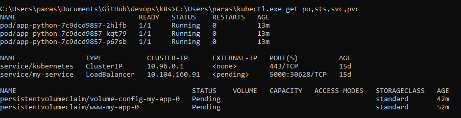

### Output

Output of command ```f kubectl get po,sts,svc,pvc```:


### Insides of files

These are insides of visits-list.txt files in my pod #1:
- 13:22:18
- 13:23:24
- 13:24:15
- 13:24:16
- 13:24:16

These are insides of visits-list.txt files in my pod #2:
- 13:22:14
- 13:22:18
- 13:22:19
- 13:22:20
- 13:24:15
- 13:24:16
- 13:24:16
- 13:24:16
- 13:24:16
- 13:24:17

These are insides of visits-list.txt files in my pod #3:
- 13:22:20
- 13:23:10
- 13:24:14
- 13:24:17
- 13:24:17 

### Difference in files

Difference of data in different pods was because with StatefulSet different replicas used different files. In Deployment before different replicas used the same file, which was not scalable solution then more replicas will come into play.

### Ordering

Ordering of replicas is crucial when some replicas should start before others. It is not our case, because our replicas are independent of each other, that is why I used "Parallel Pod Management" when configuring my StatefulSet. There was choice between Ordered and Parallel management in https://kubernetes.io/docs/concepts/workloads/controllers/statefulset/#deployment-and-scaling-guarantees (In "Pod Management Policies" section).
