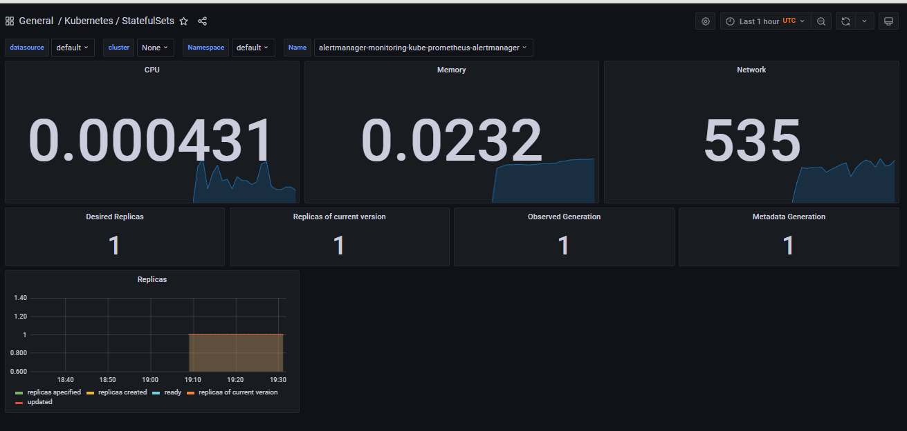
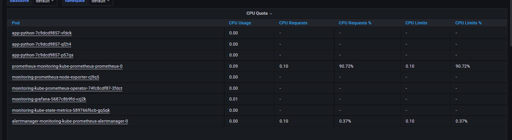
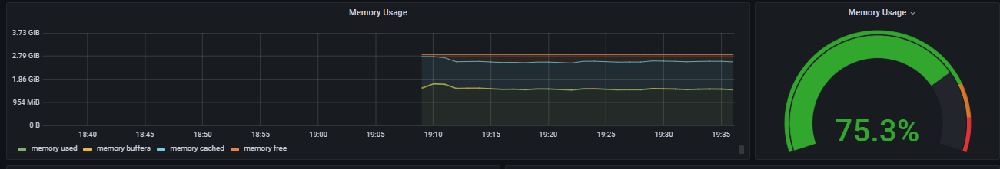
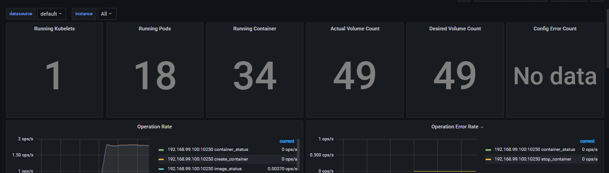
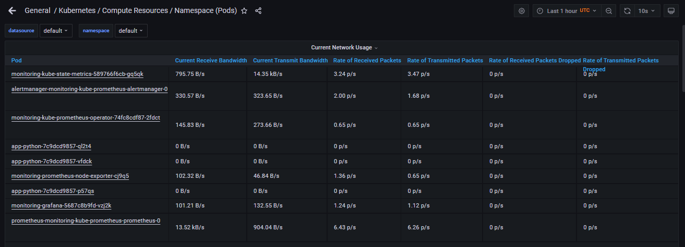
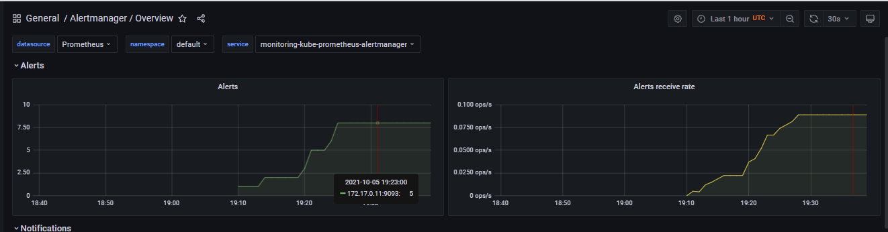
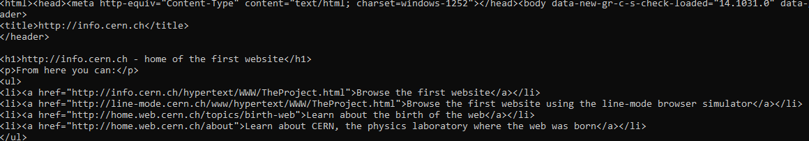

### Description of stack components

- Prometheus Operator - for operating and managing prometheus components. Automates the monitoring stack.
- Prometheus - Data Base for storing different metrics.
- Alertmanager - takes care of different alerts send.
- Node exporter -  exporter for low-level metrics(hardware or/and OS).
- Prometheus Adapter - checks metrics format, collects metrics and applies formatting.
- Kube state metrics - generate metrics about the state of objects.
- Grafana - UI of the stack, visualization of metrics.

### Command ```kubectl get po,sts,svc,pvc,cm```

Command gets all pods, StatefulSets, configMaps, persistentVolumeClaims etc (po, sts,pvc are just short names of it).

```
NAME                                                         READY   STATUS    RESTARTS   AGE
pod/alertmanager-monitoring-kube-prometheus-alertmanager-0   2/2     Running   0          24s
pod/app-python-7c9dcd9857-hdcrk                              1/1     Running   0          11m
pod/app-python-7c9dcd9857-kp6mk                              1/1     Running   0          11m
pod/app-python-7c9dcd9857-wqpkl                              1/1     Running   0          11m
pod/monitoring-grafana-5687c8b9fd-zlz8h                      2/2     Running   0          31s
pod/monitoring-kube-prometheus-operator-74fc8cdf87-lt4zn     1/1     Running   0          31s
pod/monitoring-kube-state-metrics-589766f6cb-29k76           1/1     Running   0          31s
pod/monitoring-prometheus-node-exporter-2bxwn                1/1     Running   0          31s
pod/prometheus-monitoring-kube-prometheus-prometheus-0       2/2     Running   0          23s

NAME                                                                    READY   AGE
statefulset.apps/alertmanager-monitoring-kube-prometheus-alertmanager   1/1     24s
statefulset.apps/prometheus-monitoring-kube-prometheus-prometheus       1/1     23s

NAME                                              TYPE        CLUSTER-IP      EXTERNAL-IP   PORT(S)                      AGE
service/alertmanager-operated                     ClusterIP   None            <none>        9093/TCP,9094/TCP,9094/UDP   24s
service/kubernetes                                ClusterIP   10.96.0.1       <none>        443/TCP                      11m
service/monitoring-grafana                        ClusterIP   10.97.77.163    <none>        80/TCP                       31s
service/monitoring-kube-prometheus-alertmanager   ClusterIP   10.110.211.20   <none>        9093/TCP                     31s
service/monitoring-kube-prometheus-operator       ClusterIP   10.106.11.47    <none>        443/TCP                      31s
service/monitoring-kube-prometheus-prometheus     ClusterIP   10.99.68.191    <none>        9090/TCP                     31s
service/monitoring-kube-state-metrics             ClusterIP   10.111.1.171    <none>        8080/TCP                     31s
service/monitoring-prometheus-node-exporter       ClusterIP   10.100.215.94   <none>        9100/TCP                     31s
service/my-app                                    ClusterIP   10.108.51.0     <none>        5000/TCP                     58s
service/prometheus-operated                       ClusterIP   None            <none>        9090/TCP                     23s

NAME                                                                     DATA   AGE
configmap/kube-root-ca.crt                                               1      11m
configmap/monitoring-grafana                                             1      31s
configmap/monitoring-grafana-config-dashboards                           1      31s
configmap/monitoring-grafana-test                                        1      31s
configmap/monitoring-kube-prometheus-alertmanager-overview               1      31s
configmap/monitoring-kube-prometheus-apiserver                           1      31s
configmap/monitoring-kube-prometheus-cluster-total                       1      31s
configmap/monitoring-kube-prometheus-controller-manager                  1      31s
configmap/monitoring-kube-prometheus-etcd                                1      31s
configmap/monitoring-kube-prometheus-grafana-datasource                  1      31s
configmap/monitoring-kube-prometheus-k8s-coredns                         1      31s
configmap/monitoring-kube-prometheus-k8s-resources-cluster               1      31s
configmap/monitoring-kube-prometheus-k8s-resources-namespace             1      31s
configmap/monitoring-kube-prometheus-k8s-resources-node                  1      31s
configmap/monitoring-kube-prometheus-k8s-resources-pod                   1      31s
configmap/monitoring-kube-prometheus-k8s-resources-workload              1      31s
configmap/monitoring-kube-prometheus-k8s-resources-workloads-namespace   1      31s
configmap/monitoring-kube-prometheus-kubelet                             1      31s
configmap/monitoring-kube-prometheus-namespace-by-pod                    1      31s
configmap/monitoring-kube-prometheus-namespace-by-workload               1      31s
configmap/monitoring-kube-prometheus-node-cluster-rsrc-use               1      31s
configmap/monitoring-kube-prometheus-node-rsrc-use                       1      31s
configmap/monitoring-kube-prometheus-nodes                               1      31s
configmap/monitoring-kube-prometheus-persistentvolumesusage              1      31s
configmap/monitoring-kube-prometheus-pod-total                           1      31s
configmap/monitoring-kube-prometheus-prometheus                          1      31s
configmap/monitoring-kube-prometheus-proxy                               1      31s
configmap/monitoring-kube-prometheus-scheduler                           1      31s
configmap/monitoring-kube-prometheus-statefulset                         1      31s
configmap/monitoring-kube-prometheus-workload-total                      1      31s
configmap/my-configmap                                                   0      58s
configmap/prometheus-monitoring-kube-prometheus-prometheus-rulefiles-0   28     17s
```

### Grafana metrics

- Check how much CPU and Memory your StatefulSet is consuming.


- Check which Pod is using CPU more than others and which is less in the default namespace.


- Check how much memory is used on your node, in % and mb.


- Check how many pods and containers actually ran by the Kubelet service.


- Check which Pod is using network more than others and which is less in the default namespace.


- Check how many alerts you have.


### Init container

- Output of cat command.


