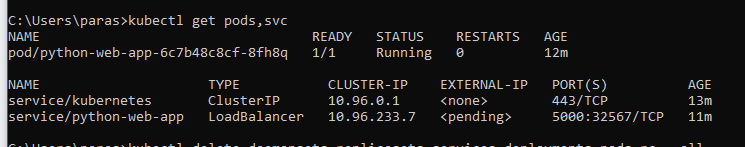
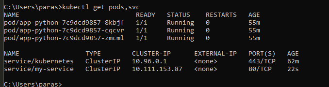
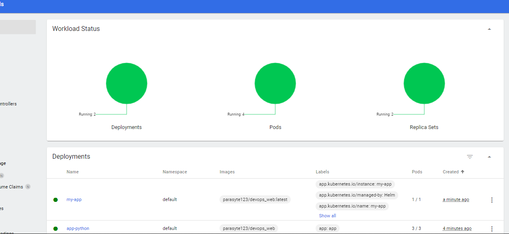
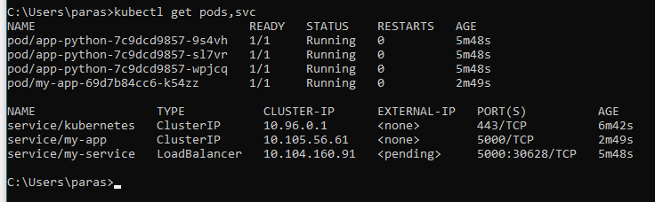
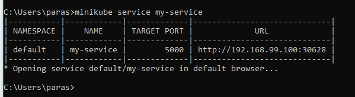
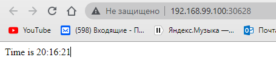

## Kubernetes

To deploy I ran commands:
- ```kubectl create deployment python-web-app --image=parasyte123/devops_web```
- ```kubectl expose deployment python-web-app --type=LoadBalancer --port=5000```

Output of command ```kubectl get pods,svc```:


In my case I had pending instead of IP adress. Guide on kubectl said that it should be pending for 1 minute only, but in my case it was pending for more than 10 minutes. So I just went to next stage without waiting more.

After making deployment and service configurations, this is output of command ```kubectl get pods,svc```:


Next I used Helm and that is my dashboard after deploying everything:


Output of command with helm ```kubectl get pods,svc```:


This is my-service report of command ```minikube service my-service```:


And this is my python time app working:
