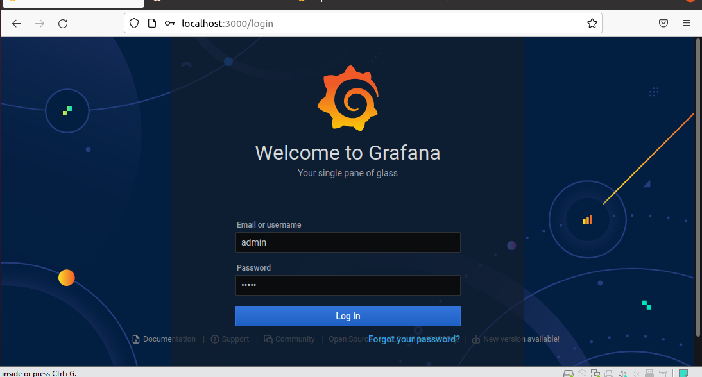
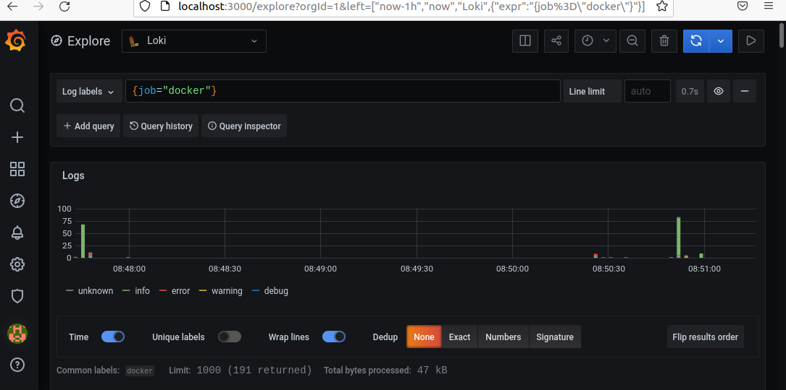
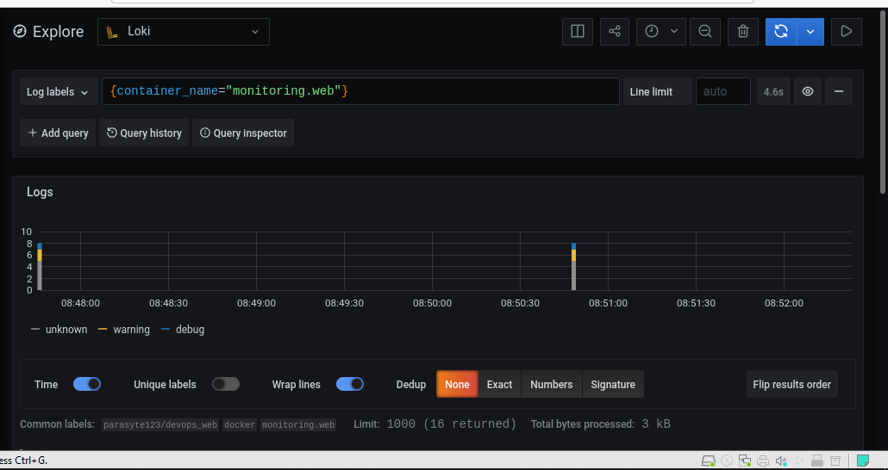
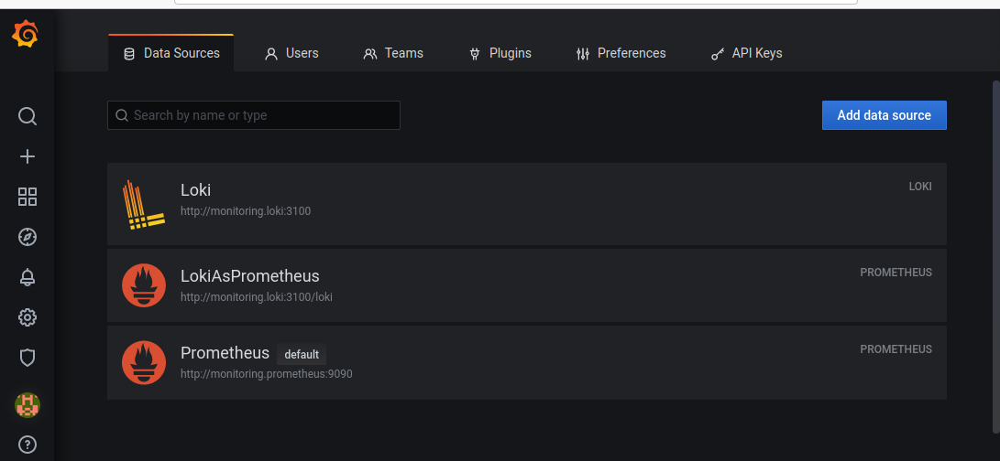
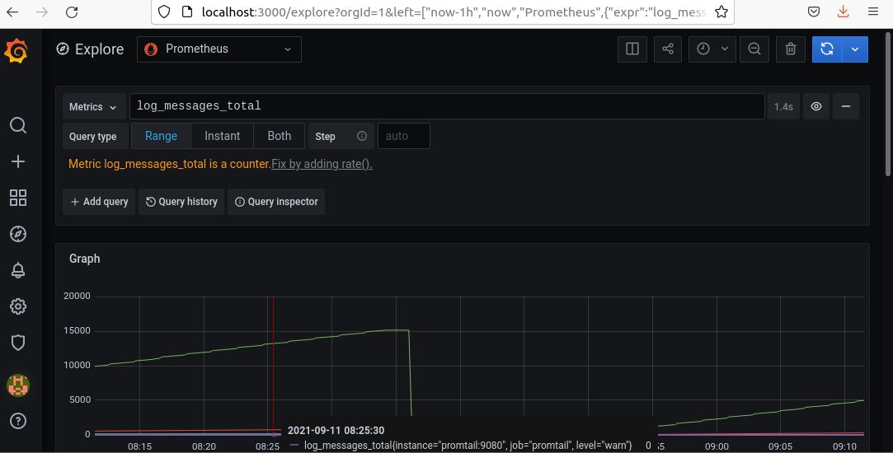
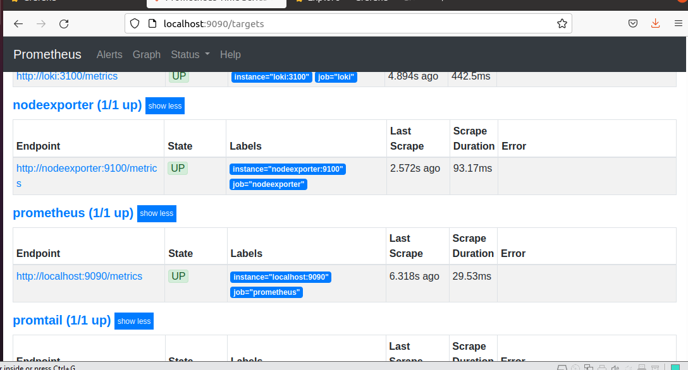
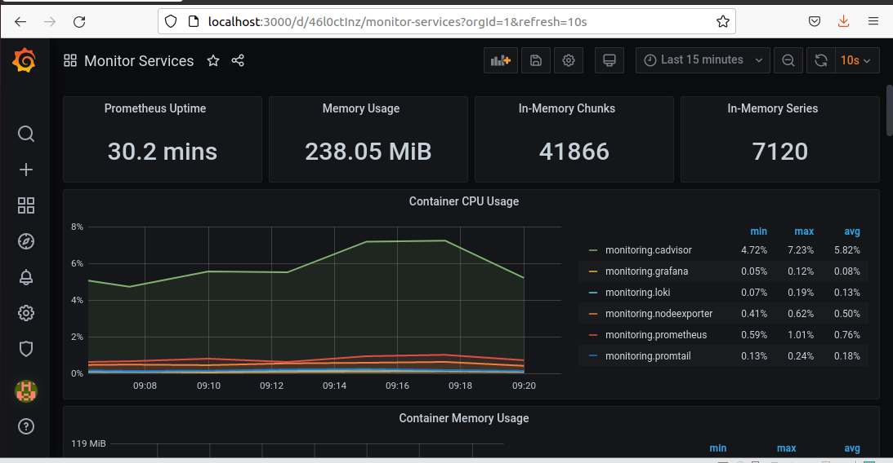
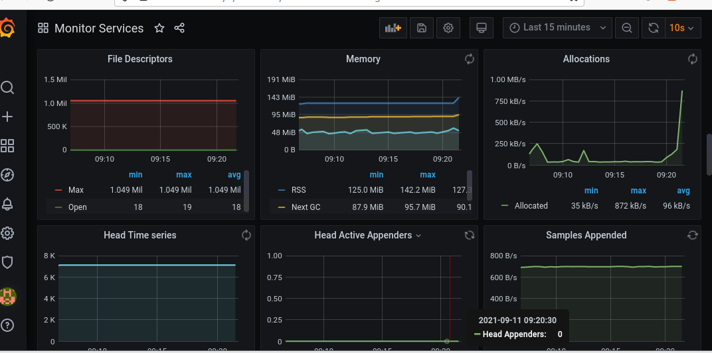
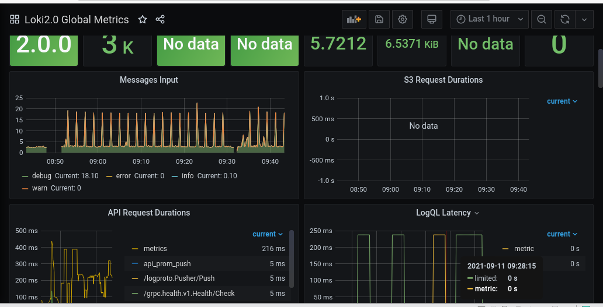
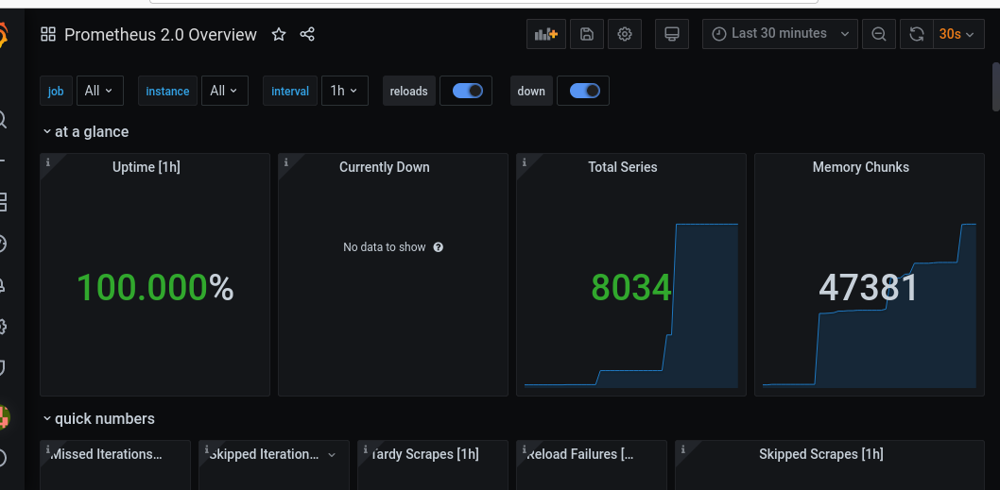

# Monitoring and Metrics

## Stack

Logging example was taken from https://github.com/black-rosary/loki-nginx , from lab task.

In example were used:

- Loki
- Cadvisor
- Prometheus (for Metrics)
- Promtail

I added my web application to this stack.

## Report logging

Command for running is ```docker-compose up```.
After build go to http://localhost:5000 and use "admin" for login and password. 

In the expore tab you will see logs and metrics.


Here is how it looks from cinfiguration tab.



## Best practices logging

- A dashboard should tell a story or answer a question. (It should be meaningful to use logs).
- Dashboards should reduce cognitive load, not add to it. (It should be easy to fing information from logs, find erros or warnings).
- For fast dashboard creation we should use templates.
- Add memory limits to log files.
From https://grafana.com/docs/grafana/latest/best-practices/best-practices-for-creating-dashboards/.

## Report metrics

Metrics could be seen in Grafana GUi and on Prometheus site.



## Best practices metrics

- Metrics should be atomic (have single unit).
- Metric names should be understandable.
- Metric names should not be changed often (ideally they should not change at all through the projects.
From https://prometheus.io/docs/practices/naming/.

## Dashboards

Here is some graphs from dashboards tab of Grafana (these are generated by default).



This is LOKI dashboard from template.

This is prometheus dashboard from template.
